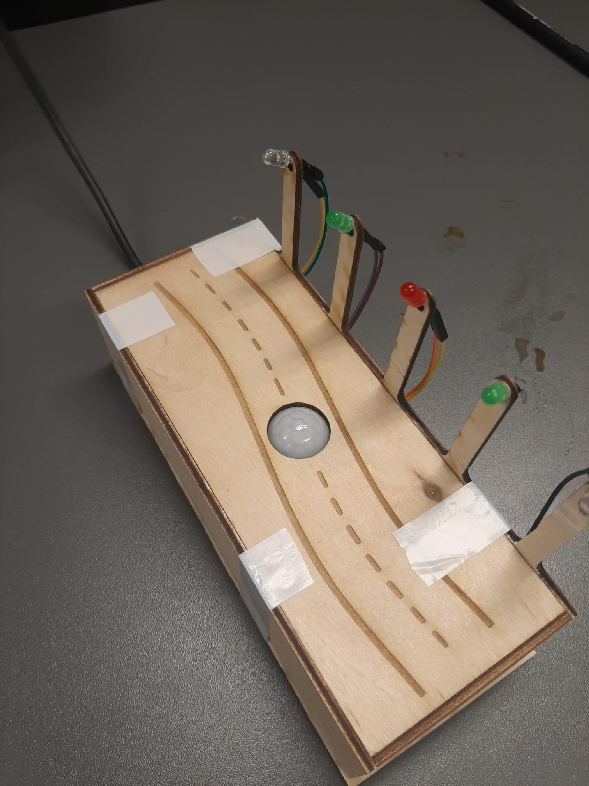
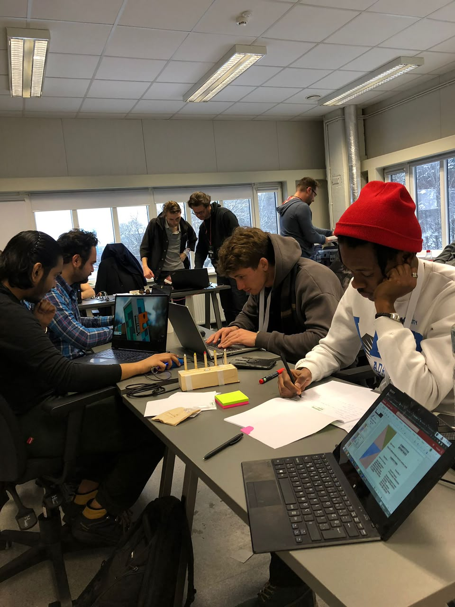
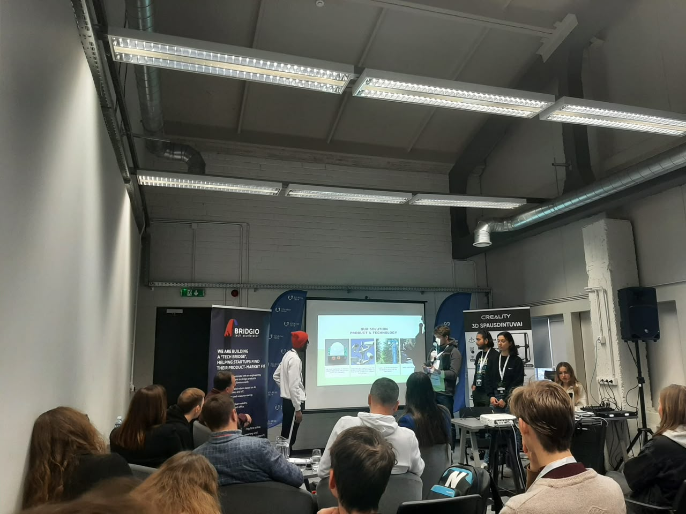

## Energy-Saving Automated Street Lighting System
**Awarded 3rd Place | Bridgio Rethinking Hardware Hackathon (Vilnius, Lithuania)**

**Project Overview**

Developed during a fast-paced hardware hackathon, this prototype demonstrates a smart-grid solution designed to drastically reduce municipal energy waste. Leading a cross-functional team of six, I spearheaded the hardware integration of an automated lighting system that dynamically responds to human pedestrian traffic while ignoring non-target heat signatures like passing vehicles. This project bridges physical hardware control with large-scale operational cost reduction.

**System Architecture**

The system operates as an event-driven control loop based on thermal detection:

* **Input Stage:** A Passive Infrared (PIR) sensor monitors the environment for changes in infrared radiation specifically matching the wavelength of human body heat (~9-10 micrometers).

* **Processing:** The microcontroller continuously polls the sensor array. To ensure the system remains responsive, non-blocking time-tracking algorithms evaluate the duration of the detected movement.

* **Output Stage:** Upon validating a human presence, the system triggers the solid-state relays (simulated via direct digital pins in the prototype) to illuminate the local LED streetlamp array, keeping them active for a predetermined safety window before initiating a power-saving shutdown.

**Hardware Reality (BOM)**

* **Microcontroller:** Arduino Uno (ATmega328P)

* **Sensors:** HC-SR501 Passive Infrared (PIR) Motion Sensor

* **Actuators:** Standard 5mm LEDs (simulating municipal street lights)

* **Enclosure:** Custom 3D-printed road chassis

* **Infrastructure:** Laser-cut wooden lamppost mounts, solderless breadboard, standard jumper wires

* **Power Distribution:** Independent DC Battery Pack

**Challenges & Debugging: The Differentiation Problem**

**Issue: False Positives from Vehicles and Local Fauna**

The most significant engineering challenge was designing a system that triggers only for human pedestrians. Basic PIR sensors trigger on any change in infrared radiation. A passing internal combustion engine (engine blocks often exceed 80°C) or large local wildlife (like moose) would trigger false positives, defeating the energy-saving purpose.

**Troubleshooting & Validation Steps:**

1. **Thermal Signature Analysis:** We conducted rapid research on thermal profiles. We determined that while cars produce massive heat, the signature is highly concentrated and fast-moving. Moose and large animals project heat at a significantly higher physical elevation than the average human.

2. **Physical Field of View (FoV) Restriction:** Instead of relying on complex machine learning algorithms—which exceeded the compute power of our microcontroller—I applied a practical hardware validation approach. We physically masked the sensor lenses to narrow their field of view.

3. **Geometric Placement:** By angling the sensors strictly toward the pedestrian sidewalk and below the typical torso height of large animals, we filtered out the road surface (cars) and ambient environmental triggers, achieving a high-fidelity human detection rate purely through strategic hardware placement.

**Resourcefulness & Rapid Prototyping**

Developing a functional hardware prototype within the tight constraints of a hackathon required strategic resource management and rapid cross-functional collaboration.

* **Infrastructure Utilization:** I coordinated with the laboratory engineers at Vilnius Tech (VGTU) to leverage the university’s rapid prototyping facilities. By maintaining clear communication and providing precise technical specifications, we utilized the on-site 3D printing infrastructure to fabricate a custom road network chassis that housed our complex sub-surface wiring safely.

* **Technical Consultation:** Rather than working in isolation, I consulted with lab engineers to validate our structural choices, ensuring the physical wooden lampposts were mechanically stable and correctly toleranced for the sensor mounts.

**Future Expansion & Automation Roadmap**

To scale this prototype into a viable municipal infrastructure product, the following integrations are necessary:

* **Decentralized Multi-Sensor Topologies:** Mounting independent, calibrated sensors on every light post, utilizing a daisy-chained communication protocol (like RS485 or I2C) to illuminate the path slightly ahead of the pedestrian's walking direction.

* **Doppler Radar / Speed Telemetry:** Integrating microwave radar modules (e.g., RCWL-0516) alongside the PIR sensors. By measuring the velocity of the moving object, the logic gate can easily filter out objects moving at vehicular speeds (>20 km/h).

* **Ambient Light Verification:** Integrating a Photoresistor (LDR) to ensure the system is completely disabled during daylight hours, establishing a secondary hardware-level power-saving gate.

